# Overdrive — Engine Steps

Every step the engine (`../overdrive`) runs, from the shader build to teardown,
with the file and function behind each one. Paths are relative to the overdrive
repo root; the Go module root is `src/`.

Companion to `how_to_vulkan/STEPS.md`: that file is the flat tutorial renderer,
this one is what the same Vulkan 1.3 feature set looks like once it is behind an
abstraction (`src/renderer/`), fed by a scene loader, and made to render 64
lights out of a shadow atlas.

---

## Full flow

```mermaid
flowchart TD

    subgraph BUILD["0 · Build time — before any run"]
        direction TB
        BS["<b>Compile shaders</b> — Slang → SPIR-V, one file per stage<br/>12 stages: forward, skybox, depth, depth_point, prepass, ui<br/>flags: <code>-emit-spirv-directly -fvk-use-scalar-layout</code><br/><code>src/build_shaders.sh</code> · <code>src/shaders/slang/*.slang</code> → <code>src/shaders/vk/*.spv</code> (gitignored)"]
        BS2["<b>Scene authoring</b> — Blender add-on exports XML + OBJ/MTL<br/><code>xml_export.py</code> (repo root) → <code>assets/*.xml</code>, <code>assets/meshes/</code>, <code>assets/textures/</code>"]
        BS --> BS2
    end

    BUILD --> S1

    subgraph START["1 · Startup — main()"]
        direction TB
        S1["<b>Parse flags</b> <code>-config</code> (default vulkan.toml), <code>-scene</code> (showcase.xml)<br/><code>src/main.go:main</code>"]
        S2["<b>Resolve the project root</b> — walk up for assets/ + src/,<br/>or <code>OVERDRIVE_ROOT</code>. Nothing else may hold a relative path<br/><code>src/paths/paths.go:Root, Config, Asset, Mesh, Texture, Shader</code>"]
        S3["<b>Load settings</b> — TOML → validated globals.<br/>A bad shadow layout <i>rejects the file</i> rather than clamping<br/><code>src/settings/config.go:Load, apply, checkShadowAtlas</code> · <code>configs/vulkan.toml</code>, <code>configs/low.toml</code>"]
        S4["<b>Uniform layout guard</b> — package init panics if any of the<br/>four blocks stopped matching common.slang (72 / 4848 / 96 / 128 bytes)<br/><code>src/renderer/uniforms.go:init</code>"]
        S1 --> S2 --> S3 --> S4
    end

    S4 --> A1

    subgraph APP["2 · core.NewApp — window + backend"]
        direction TB
        A1["<b>Build the backend object</b> (no Vulkan call yet):<br/>reserve index 0 in the buffer/mesh/target tables<br/><code>src/vulkan/backend.go:New</code>"]
        A2["<b>GLFW window</b>, ClientAPI=NoAPI, size from settings<br/><code>src/core/app.go:NewApp</code>"]
        A3["<b>Input callbacks</b> — framebuffer resize, scroll, mouse look<br/>(skipped entirely when <code>[debug] lockCamera</code>)<br/><code>src/input/callback.go</code> · <code>src/input/input.go</code>"]
        A4["<b>Backend.Init(window)</b><br/><code>src/vulkan/backend.go:Init</code>"]
        A1 --> A2 --> A3 --> A4
    end

    A4 --> I1

    subgraph INIT["3 · Backend.Init — the device stack"]
        direction TB
        I1["<b>Instance</b> — API 1.3, GLFW's extensions,<br/>validation layer only when <code>[debug] validation</code><br/><code>backend.go:createInstance</code>"]
        I2["<b>Physical device + queue family</b> (device 0, first graphics family)<br/><b>Logical device</b>: descriptor indexing, buffer device address,<br/>synchronization2, dynamic rendering, <b>geometry shader</b>,<br/><b>scalar block layout</b>, partially-bound + update-after-bind descriptors<br/><code>backend.go:createSurfaceAndDevice</code>"]
        I3["<b>Surface</b> from the window, present support checked on that family<br/><code>backend.go:createSurfaceAndDevice</code>"]
        I4["<b>VMA allocator</b> with BUFFER_DEVICE_ADDRESS<br/><code>backend.go:Init</code>"]
        I5["<b>Sample count</b> — settings.MSAASamples intersected with the<br/>device's colour <i>and</i> depth limits, before anything is sized<br/><code>src/vulkan/swapchain.go:pickSampleCount</code>"]
        I6["<b>Swapchain</b> B8G8R8A8_UNORM, FIFO, + views,<br/>+ one render-complete semaphore <i>per image</i>,<br/>+ MSAA colour buffer, + shared depth buffer<br/><code>swapchain.go:createSwapchain, createMSAABuffer, createDepthBuffer</code>"]
        I7["<b>Command pool</b> (RESET_COMMAND_BUFFER)<br/><code>backend.go:Init</code>"]
        I8["<b>Per-frame data ×2</b> — command buffer, fence (signalled),<br/>acquire semaphore, and a mapped <b>uniform arena</b> whose<br/>device address every push constant points into<br/><code>backend.go:createFrameData</code>"]
        I9["<b>Four samplers</b> — repeat (anisotropic, clamped to device limit),<br/>cube clamp, cube shadow (nearest), 2D shadow<br/>(nearest + white border ⇒ outside the sun's frustum reads lit)<br/><code>backend.go:createSamplers</code>"]
        I10["<b>One descriptor set for the whole engine</b>:<br/>binding 0/1 bindless 2D + cube arrays,<br/>binding 2/3 <i>dedicated</i> static/dynamic atlas<br/>(dedicated because PCF taps 9× and a dynamic index cost ~1.7× frame time)<br/><code>backend.go:createDescriptors</code>"]
        I11["<b>Global pipeline layout</b> — that set + a 24-byte push constant:<br/>three device addresses (frame, draw, records)<br/><code>backend.go:createGlobalPipelineLayout</code> · <code>src/vulkan/draw.go:pushAddresses</code>"]
        I12["<b>Default textures</b> — white pixel in 2D slot 0, black cube in cube slot 0,<br/>both atlas bindings seeded with the white pixel<br/><code>backend.go:createDefaultTextures</code>"]
        I1 --> I2 --> I3 --> I4 --> I5 --> I6 --> I7 --> I8 --> I9 --> I10 --> I11 --> I12
    end

    I12 --> L1

    subgraph LOAD["4 · Scene load — scene.NewScene"]
        direction TB
        L1["<b>Parse the XML</b> into meshes, lights, camera — no GPU work,<br/>which is what makes the scene tests runnable without a GPU<br/><code>src/scene/scene.go:LoadScene</code> · <code>assets/*.xml</code>"]
        L2["<b>Per mesh</b>: parse OBJ + MTL, interleave pos|normal|uv,<br/>compute the bounding sphere used for caster culling<br/><code>src/scene/mesh.go:toMesh, parseOBJ, parseMTL, fillVertices</code>"]
        L3["<b>Lights</b>: XML → LightData, each with a radius derived from<br/>colour/intensity so the shader can bail before the BRDF<br/><code>src/scene/light.go:toLight, lightRadius</code>"]
        L4["<b>Upload meshes</b> — one vertex buffer per mesh, one mesh handle<br/>per material face group, plus colour and normal-map textures<br/><code>src/scene/mesh.go:setup</code> → <code>src/vulkan/buffer.go</code>, <code>src/vulkan/texture.go</code>"]
        L5["<b>Shadow atlas</b> — carve the fixed slot layout from settings,<br/>create <b>two</b> 4096² depth targets (static + dynamic), same layout in both<br/><code>src/scene/shadowatlas.go:setup, reset, buildLayout</code>"]
        L6["<b>Skybox</b> — six faces → one cubemap + the cube mesh<br/><code>src/scene/skybox.go:setup</code> · <code>assets/textures/skybox/</code>"]
        L1 --> L2 --> L3 --> L4 --> L5 --> L6
    end

    L6 --> W1

    subgraph WORLD["5 · ECS world + run prologue"]
        direction TB
        W1["<b>Wire physics entities</b> to scene meshes by name (Ground, Sphere, Sphere2)<br/><code>src/main.go:createWorld</code> · <code>src/ecs/</code> · <code>src/physics/</code>"]
        W2["<b>Load the six shader sets</b> — SPIR-V modules only, pipelines are lazy<br/>forward · depth · depth_point · prepass · ui · skybox<br/><code>src/core/app.go:Run</code> → <code>src/vulkan/shader.go:CreateShader, loadModule</code>"]
        W3["<b>Overlay quad</b> uploaded as an ordinary LayoutPositionUV mesh<br/><code>src/core/ui.go:createOverlayQuad</code>"]
        W1 --> W2 --> W3
    end

    W3 --> LOOP

    LOOP{"window open?<br/><code>core/app.go:Run</code>"}
    LOOP -- no --> D1

    subgraph FRAME["6 · One frame"]
        direction TB

        F1["<b>Physics + ECS step</b> (fixed 1/60), then re-upload the vertices<br/>of any mesh a body moved; the moved list feeds shadow dirtying<br/><code>src/ecs/entity.go:Update</code> · <code>src/scene/scene.go:UpdateMeshes</code>"]
        F2["<b>Input</b> — camera moved before anything is recorded<br/><code>src/input/input.go:DefaultInput</code>"]
        F3["<b>BeginFrame</b> — wait this slot's fence, acquire an image<br/>(recreating the swapchain on OUT_OF_DATE), reset the arena,<br/>begin the command buffer, bind the one descriptor set,<br/>flush staged texture uploads, write an empty record at arena head<br/><code>src/vulkan/backend.go:BeginFrame</code>"]

        subgraph SH["6a · Shadow bookkeeping — CPU only"]
            direction TB
            G1["<b>Allocate tiles</b>: score every light (radius / distance),<br/>rank picks the slot, the tier caps it; two hysteresis margins<br/>(<code>nextTierThreshold</code>, <code>slotStickiness</code>) stop per-frame churn<br/><code>shadowatlas.go:allocate, rankRequests, planByTier,<br/>offerSpareSlots, keepMatchingAllocs, rebuildFreeLists, assignPlanned</code>"]
            G2["<b>Mark dirty</b> — per light: does it hold a valid static tile,<br/>is a movable caster in range, did one move?<br/><code>shadowatlas.go:markDirtyTiles, movableCasterInRange, movedCasterInRange</code>"]
            G3["<b>Queue static bakes</b> — all or nothing: a tile whose frustum holds<br/>no caster writes nothing, so a partial re-bake leaves stale depth<br/><code>shadowatlas.go:queueStaticBakes</code>"]
            G4["<b>Queue dynamic bakes</b> in score order, within <code>bakeTexelBudget</code>;<br/>a light that misses out keeps the tile it has<br/><code>shadowatlas.go:queueDynamicBakes</code>"]
            G5["<b>Build records</b> — one ShadowRecord per tile: LightSpace matrix<br/>(bakes <i>and</i> samples it), atlas uv rect, PCF step, far plane,<br/>face index, Flags bit 0 = which atlas to sample<br/><code>shadowatlas.go:buildRecords, shadowRecord</code>"]
            G6["<b>Commit</b> — queued ⇒ valid, forget this frame's movers<br/><code>shadowatlas.go:commitBakes</code>"]
            G1 --> G2 --> G3 --> G4 --> G5 --> G6
        end

        F4["<b>Publish records</b> once per frame — memcpy'd into the arena,<br/>its address pushed with every draw<br/><code>src/vulkan/draw.go:BindShadowRecords, writeArenaSlice</code>"]
        F5["<b>Fill FrameUniforms</b> — camera matrices, up to 64 LightData<br/>(each carrying its ShadowIndex/Count), both atlas handles,<br/>skybox handle, ShadowNormalScale = 4096/atlasSize<br/><code>src/scene/scene.go:FillFrameUniforms</code>"]

        subgraph BAKE["6b · Shadow bakes — skipped entirely by a settled scene"]
            direction TB
            B1["<b>Static atlas pass</b> (depth only, no colour clear) when allocation moved.<br/>Per tile: frustum-cull casters, then SetViewportScissor to that rect,<br/>rebind FrameUniforms with the tile's matrix, draw immovable casters<br/><code>shadowatlas.go:BakeShadows, bakeLight</code> → <code>backend.go:BeginPass(depth target)</code>"]
            B2["<b>CopyDepthRegion per dirty dynamic tile</b> — outside any pass;<br/>same slot layout in both atlases, so the blit needs no remap<br/><code>shadowatlas.go:BakeShadows</code> → <code>backend.go:CopyDepthRegion</code>"]
            B3["<b>Dynamic atlas pass</b>, keepDepth=true (loads the copy),<br/>drawing only the <i>movable</i> casters on top<br/><code>shadowatlas.go:bakeLight(movable=true)</code>"]
            B1 --> B2 --> B3
        end

        F6["<b>Depth prepass</b> on the backbuffer — depth only, no colour attachment,<br/>StoreOp=Store. prepass.slang must combine P·V·M in <i>exactly</i><br/>forward.slang's order, since EQUAL rejects a last-bit difference<br/><code>src/scene/scene.go:RunDepthPrepass</code> → <code>backend.go:BeginDepthPrepass</code> · <code>shaders/slang/prepass.slang</code>"]
        F7["<b>Main pass</b> — the only pass that clears colour; keeps the prepass depth.<br/>Draws into the MSAA image and resolves into the swapchain image<br/><code>core/app.go:Run</code> → <code>backend.go:BeginPass(Backbuffer, clear, keepDepth)</code>"]
        F8["<b>Skybox</b> — view translation stripped, depth compare LEQUAL<br/>so the cube sits exactly on the far plane<br/><code>src/scene/skybox.go:RenderSkybox</code> · <code>shaders/slang/skybox.slang</code>"]
        F9["<b>Forward scene</b> — depth compare <b>EQUAL</b> (prepass survivors only).<br/>Per face group: material fields + texture slots into DrawUniforms.<br/>Cook-Torrance PBR, 64 lights with a radius early-out, PCF from the atlas<br/><code>src/scene/scene.go:RenderScene</code> · <code>src/scene/mesh.go:draw</code> · <code>shaders/slang/forward.slang</code>"]
        F10["<b>UI overlay</b> — widget tree rasterised on the CPU into an RGBA image,<br/>re-uploaded only when the tree or hover state changed,<br/>drawn as a fullscreen quad that tests depth but does not write<br/><code>src/core/ui.go:renderUI</code> · <code>shaders/slang/ui.slang</code>"]
        F11["<b>EndPass</b> — end dynamic rendering; an offscreen target also<br/>transitions to shader-read here<br/><code>backend.go:EndPass</code>"]
        F12["<b>EndFrame</b> — barrier the swapchain image to PRESENT_SRC,<br/>submit (wait acquire sem, signal the <i>image's</i> render sem, signal fence),<br/>present, advance the frame slot<br/><code>backend.go:EndFrame</code>"]
        F13["<b>FPS + bake counters</b> printed once a second, then PollEvents.<br/><code>bakes: 0 static 0 dynamic</code> is what a settled scene must show<br/><code>core/app.go:Run</code> · <code>shadowatlas.go:BakeCounts</code>"]

        F1 --> F2 --> F3 --> G1
        G6 --> F4 --> F5 --> B1
        B3 --> F6 --> F7 --> F8 --> F9 --> F10 --> F11 --> F12 --> F13
    end

    LOOP -- yes --> F1
    F13 --> LOOP

    subgraph DRAWPATH["Every draw goes through this — src/vulkan/draw.go"]
        direction TB
        P1["<b>Draw(mesh, DrawUniforms)</b> — the only draw entry point"]
        P2["<b>Pipeline lookup</b> — keyed by (shader, pass kind, vertex layout),<br/>built on first use; cull mode and depth compare stay dynamic state<br/><code>src/vulkan/shader.go:getPipeline</code>"]
        P3["<b>Translate handles → bindless slots</b> (diffuse, normal map, skybox)<br/><code>texture.go:slot2D, slotCube</code>"]
        P4["<b>memcpy the block into this frame's arena</b> (64-byte aligned),<br/>push the three device addresses, bind buffers, CmdDraw(Indexed)<br/><code>draw.go:bindDrawUniforms, writeArena</code>"]
        P1 --> P2 --> P3 --> P4
    end

    F9 -.-> P1
    F10 -.-> P1
    B1 -.-> P1

    subgraph TEARDOWN["7 · Shutdown"]
        direction TB
        D1["<b>Backend.Shutdown</b> — DeviceWaitIdle, then drain the deferred-destroy<br/>queue and destroy every object in reverse creation order<br/><code>src/vulkan/backend.go:Shutdown</code>"]
        D2["<b>glfw.Terminate</b><br/><code>src/core/app.go:Run</code>"]
        D1 --> D2
    end

    D2 --> END(["exit"])

    subgraph RESIZE["Out of band · swapchain recreation"]
        direction TB
        R1["Framebuffer resize callback, or OUT_OF_DATE from acquire/present<br/><code>src/input/callback.go:FramebufferSizeCallback</code> · <code>backend.go:BeginFrame, EndFrame</code>"]
        R2["Wait all frames, destroy views/MSAA/depth/semaphores,<br/>rebuild from the stored create-info with the new extent<br/><code>src/vulkan/swapchain.go:recreateSwapchain, destroySwapchain</code>"]
        R1 --> R2
    end
```



---

## Step notes

### 0 · Build time
Shaders are authored **once**, in Slang, and never read at runtime. `build_shaders.sh`
emits one `.spv` per stage into `src/shaders/vk/` (git-ignored, so a fresh clone
builds and tests but cannot run until the script has run once). Two flags matter:
`-fvk-use-scalar-layout`, which is what makes Go's struct packing a legal uniform
layout, and `-emit-spirv-directly`.

Validation of the output needs the matching flag — plain `spirv-val` rejects these
modules because `LightData` is 72 bytes and the array stride is not 16-aligned:

```sh
for f in src/shaders/vk/*.spv; do spirv-val --scalar-block-layout "$f"; done
```

### 1 · Startup
`settings.Load` runs **before** `NewApp`, since the window and backend read it.
Config validation is strict on purpose: a shadow layout that cannot be carved
rejects the file rather than being clamped, because the failure mode downstream
is silent (every light gets `ShadowIndex = -1` and the scene renders unshadowed
with nothing logged).

`paths` resolves everything against a discovered project root, so `go run .` from
`src/` and `go test ./scene/` see the same files.

The `init()` in `src/renderer/uniforms.go` is the layout guard: it panics if any
of the four blocks changed size. It cannot catch two members **swapped** — same
size, silent garbage — so a `common.slang` edit still means rebuild and look.

### 2–3 · Window and device
The backend object is built before GLFW so it can set its own window hints. Then
`Init` walks the same device-stack order as the tutorial renderer, with five extra
device features the engine needs:

| Feature | Why |
| --- | --- |
| `GeometryShader` | the point-light depth pass |
| `ScalarBlockLayout` | the `-fvk-use-scalar-layout` SPIR-V |
| `DescriptorBindingPartiallyBound` | bindless arrays with holes |
| `DescriptorBindingSampledImageUpdateAfterBind` | textures uploaded mid-run |
| MSAA sample count | resolved against **both** colour and depth limits |

Two design choices worth naming:

- **One descriptor set for the entire engine**, bound once per frame in
  `BeginFrame`. Bindings 0/1 are bindless arrays; bindings 2/3 are *dedicated*
  descriptors for the two atlases, because PCF taps them 9× per fragment and some
  drivers re-fetch a dynamically-indexed descriptor per tap — measured at ~1.7×
  frame time.
- **No uniform buffers, no per-object descriptor sets.** Each frame owns a mapped
  arena; every block is memcpy'd into it and reached by device address, pushed as
  a 24-byte push constant (`frame`, `draw`, `records`).

### 4 · Scene load
`LoadScene` is pure parsing — no graphics calls — which is what keeps
`go test ./...` runnable without a GPU. `NewScene` then does all the uploads:
mesh buffers, material textures, the two atlas render targets, the skybox cubemap.

The atlas is created **once for the whole scene**, not per casting light. Who
occupies which slot is a per-frame decision (step 6a).

### 5 · Run prologue
Six shader sets are loaded as SPIR-V modules only. Pipelines are built lazily in
`getPipeline`, keyed by `(shader, pass kind, vertex layout)` — a pipeline bakes in
attachment formats and vertex layout, so one shader needs one per combination it
is actually drawn with.

### 6 · The frame

**6a — shadow bookkeeping (CPU only).** Every light scores `radius / distance to
camera`. Rank picks the slot, the tier caps it: an unimportant light cannot claim
a slot it would waste, and phase 1b re-offers spare slots to lights that ended up
under their ceiling. Two hysteresis margins guard two different axes — 
`nextTierThreshold` stops a boundary score changing a light's ceiling every frame,
`slotStickiness` stops two near-equal lights trading a contended pool's last slot.
Running out of atlas costs the least important light its resolution, never frame
time; it finally leaves `ShadowIndex = -1` and that light renders unshadowed.

**6b — the static/dynamic split.** `staticAtlas` holds casters that cannot move
and is re-baked only when allocation moved — **all or nothing**, because a tile
whose frustum holds no caster writes nothing and would otherwise wear its previous
owner's depth. `dynamicAtlas` is a `CopyDepthRegion` of the static tile plus the
movable casters drawn on top, per tile, capped at `bakeTexelBudget` per frame in
score order. Both atlases carve the same layout, so the copy needs no remap.
`ShadowRecord.Flags` bit 0 is which one a light samples.

A settled scene bakes nothing at all — that is what the `bakes:` counter beside
the FPS is for.

**Pass order and why.** Depth prepass first, so the forward pass shades each
visible fragment once instead of once per surface stacked behind it. The main pass
then loads that depth (`keepDepth`) and runs with `EQUAL`. This is only correct if
`prepass.slang` combines `projection`, `view` and `model` in exactly the order
`forward.slang`'s `vsMain` does — EQUAL rejects a last-bit difference and shows it
as speckle, not as an error. Turning `depthPrepass` off is the A/B for that.

**Clears live in one place.** `BeginPass` is the only thing that clears or sets a
full viewport; `SetViewportScissor` narrows within a pass (that is how one atlas
pass draws many tiles). Free-floating clears in scene or core code are a broken
invariant.

**Conventions that silently mirror the image if broken:** the main pass uses a
**negative-height viewport** (clip space comes out y-up, matching the projections
in `scene/`), which flips winding and so keeps CCW front faces; the shadow passes
use a positive viewport and declare `FrontFace = Clockwise`. Projections are the
OpenGL convention, so every vertex stage calls `TO_VK_DEPTH`.

**Atlas sampling rules:** clamp every PCF tap to the tile inset by one texel (an
atlas has no border — the neighbour is another light's shadow), and widen each
cube face to `90° + 2 texels` (no cross-face filtering).

### 7 · Shutdown
`DeviceWaitIdle`, then age out the deferred-destruction queue (textures retired
mid-run are held for `framesInFlight + 1` frames), then destroy in reverse
creation order.

---

## Where each step lives

| Step | Files |
| --- | --- |
| Shader build | `src/build_shaders.sh`, `src/shaders/slang/`, `src/shaders/vk/` |
| Config | `configs/*.toml`, `src/settings/config.go`, `src/settings/settings.go` |
| Path resolution | `src/paths/paths.go` |
| Entry point / demo wiring | `src/main.go` |
| Window, frame loop, UI overlay | `src/core/app.go`, `src/core/ui.go` |
| Abstraction (28-method Backend contract, handles, uniform structs) | `src/renderer/backend.go`, `src/renderer/uniforms.go` |
| Device stack, frames, passes, barriers | `src/vulkan/backend.go` |
| Swapchain, MSAA, depth, recreation | `src/vulkan/swapchain.go` |
| Pipelines, SPIR-V modules | `src/vulkan/shader.go` |
| Draws, arena, push constants | `src/vulkan/draw.go` |
| Buffers, meshes | `src/vulkan/buffer.go` |
| Textures, cubemaps, render targets | `src/vulkan/texture.go` |
| Scene parse, frame uniforms, prepass, forward | `src/scene/scene.go` |
| Meshes, OBJ/MTL, materials | `src/scene/mesh.go`, `src/scene/material.go`, `src/scene/image.go` |
| Lights | `src/scene/light.go` |
| Shadow atlas: allocation, dirtying, records, bakes | `src/scene/shadowatlas.go` |
| Skybox | `src/scene/skybox.go`, `assets/textures/skybox/` |
| Camera | `src/scene/camera.go` |
| Input | `src/input/input.go`, `src/input/callback.go` |
| ECS, physics | `src/ecs/`, `src/physics/` |
| Scenes and assets | `assets/*.xml`, `assets/meshes/`, `assets/textures/` |
| Blender exporter | `xml_export.py` (repo root) |
| Docs | `notes/OVERVIEW.md`, `notes/ENGINE_FLOW.md`, `notes/ARCHITECTURE.md`, `notes/FEATURES.md` |

## The four invariants

1. **Nothing above `renderer/` imports a graphics API.** Scene, core, ecs, input
   and physics hold opaque handles the backend interprets in its own table. This
   is what keeps `go test ./...` GPU-free.
2. **Clears and viewports exist only inside `BeginPass`**, narrowed within a pass
   by `SetViewportScissor` on an atlas target.
3. **Uniforms are three typed structs split by update frequency** —
   `FrameUniforms` (4848 B, per pass), `DrawUniforms` (128 B, per draw),
   `ShadowRecord[]` (96 B each, per frame) — all mirroring
   `shaders/slang/common.slang` field for field under scalar layout.
4. **Shaders are authored once in Slang**; `build_shaders.sh` runs before the
   first build and after every shader edit.

## What differs from `how_to_vulkan/`

| | how_to_vulkan | Overdrive |
| --- | --- | --- |
| Structure | one `main()`, package globals | `renderer.Backend` interface + `vulkan` implementation |
| Passes per frame | 1 | up to 5 (static atlas, dynamic atlas, prepass, main, + copies) |
| Uniforms | one buffer per frame, one push constant | per-frame arena, three pushed addresses |
| Descriptors | one variable-count texture array | bindless 2D + cube arrays, plus dedicated atlas bindings |
| Shaders | one module, compiled at runtime (C++) / embedded (Go) | six sets, precompiled from Slang, pipelines cached per (pass, layout) |
| Depth | one image, cleared per frame | prepass-stored backbuffer depth + two 4096² atlases |
| MSAA | 1 sample | device-clamped, resolved in the main pass |
| Lights | 1 hardcoded | 64, scored and tiled per frame |
