# How to Vulkan — Step by Step

Walkthrough of every step in `_reference.cpp` (Sascha Willems, C++) and its Go port
`main.go`, in execution order. Both files do the **same Vulkan calls in the same
order**; only the host-side libraries differ:

| Reference (C++) | Go port | Why |
| --- | --- | --- |
| SDL3 | GLFW | window, surface, input |
| volk | loader in `vk` package | function pointer loading |
| VMA (C++) | `vk.VmaAllocator` | same API shape |
| Slang (runtime compile) | embedded SPIR-V (`shaders.Vert/Frag`) | no Go Slang binding |
| KTX textures | `texture.Solid` | no asset dependency |
| tinyobjloader | `internal/obj` (+ cube fallback) | pure Go |
| GLM | mathgl | matrix math |

The one Vulkan-level difference: the reference submits with `vkQueueSubmit` (v1),
the Go port uses `vk.QueueSubmit2` (`vkQueueSubmit2`), because the bindings are
synchronization2-only.

---

## Full flow

```mermaid
flowchart TD

    START(["main()"]) --> A1

    subgraph BOOT["1 · Bootstrap & window"]
        direction TB
        A1["<b>Init platform</b><br/>C++: SDL_Init + SDL_Vulkan_LoadLibrary + volkInitialize<br/>Go: glfw.Init, VulkanSupported, ClientAPI=NoAPI"]
        A2["<b>Create window</b> 1280x720, resizable<br/>Go creates window <i>before</i> instance:<br/>GLFW queries required extensions from the window"]
        A1 --> A2
    end

    A2 --> B1

    subgraph INST["2 · Instance & physical device"]
        direction TB
        B1["<b>Create instance</b> — connection to the loader.<br/>API 1.3 + platform surface extensions<br/><code>vk.CreateInstance</code> → vkCreateInstance"]
        B2["<b>List GPUs</b>, pick index (argv[1], default 0)<br/><code>vk.EnumeratePhysicalDevices</code><br/><code>vk.GetPhysicalDeviceProperties2</code>"]
        B3["<b>Pick queue family</b> with GRAPHICS bit<br/><code>vk.GetPhysicalDeviceQueueFamilyProperties</code>"]
        B1 --> B2 --> B3
    end

    B3 --> C1

    subgraph DEV["3 · Logical device"]
        direction TB
        C1["<b>Create device</b> + 1 queue.<br/>Enabled features: descriptorIndexing,<br/>shaderSampledImageArrayNonUniformIndexing,<br/>descriptorBindingVariableDescriptorCount,<br/>runtimeDescriptorArray, bufferDeviceAddress,<br/>samplerAnisotropy, synchronization2, dynamicRendering.<br/>Extension: VK_KHR_swapchain<br/><code>vk.CreateDevice</code>"]
        C2["<b>Fetch queue handle</b><br/><code>vk.GetDeviceQueue</code>"]
        C3["<b>Create VMA allocator</b> (BUFFER_DEVICE_ADDRESS bit)<br/><code>vk.VmaCreateAllocator</code>"]
        C1 --> C2 --> C3
    end

    C3 --> D1

    subgraph SURF["4 · Surface"]
        direction TB
        D1["<b>Create surface</b> from the window<br/>C++: SDL_Vulkan_CreateSurface<br/>Go: window.CreateWindowSurface → vk.SurfaceKHR"]
        D2["<b>Check present support</b> on the chosen family<br/><code>vk.GetPhysicalDeviceSurfaceSupportKHR</code>"]
        D3["<b>Query caps</b> → extent.<br/>currentExtent 0xFFFFFFFF ⇒ use window size<br/><code>vk.GetPhysicalDeviceSurfaceCapabilitiesKHR</code>"]
        D1 --> D2 --> D3
    end

    D3 --> E1

    subgraph SWAP["5 · Swapchain"]
        direction TB
        E1["<b>Create swapchain</b><br/>B8G8R8A8_SRGB, SRGB_NONLINEAR, FIFO (vsync),<br/>usage COLOR_ATTACHMENT, minImageCount from caps.<br/>CreateInfo kept for resize reuse<br/><code>vk.CreateSwapchainKHR</code>"]
        E2["<b>Get swapchain images</b><br/><code>vk.GetSwapchainImagesKHR</code>"]
        E3["<b>One 2D image view per image</b> (COLOR aspect)<br/><code>vk.CreateImageView</code> ×N"]
        E1 --> E2 --> E3
    end

    E3 --> F1

    subgraph DEPTH["6 · Depth attachment"]
        direction TB
        F1["<b>Probe depth format</b>: D32_SFLOAT_S8_UINT,<br/>else D24_UNORM_S8_UINT — must support<br/>DEPTH_STENCIL_ATTACHMENT in optimal tiling<br/><code>vk.GetPhysicalDeviceFormatProperties2</code>"]
        F2["<b>Create depth image</b> (window-sized, dedicated alloc)<br/><code>allocator.VmaCreateImage</code>"]
        F3["<b>Create depth view</b> (DEPTH aspect)<br/><code>vk.CreateImageView</code>"]
        F1 --> F2 --> F3
    end

    F3 --> G1

    subgraph MESH["7 · Mesh data"]
        direction TB
        G1["<b>Load mesh</b> — C++: tinyobj suzanne.obj<br/>Go: obj.Load, cube fallback.<br/>Indices narrowed to uint16"]
        G2["<b>One buffer, two regions</b>:<br/>vertices at 0, indices at vBufSize.<br/>Usage VERTEX | INDEX, host-mapped<br/><code>allocator.VmaCreateBuffer</code>"]
        G3["<b>Copy into mapped memory</b><br/><code>vk.MemCopy</code> ×2"]
        G1 --> G2 --> G3
    end

    G3 --> H1

    subgraph UBO["8 · Per-frame shader data buffers"]
        direction TB
        H1["<b>maxFramesInFlight = 2 uniform buffers</b>,<br/>usage SHADER_DEVICE_ADDRESS, persistently mapped<br/><code>allocator.VmaCreateBuffer</code> ×2"]
        H2["<b>Get device address</b> of each — pushed to the<br/>vertex shader as an 8-byte push constant<br/><code>vk.GetBufferDeviceAddress</code>"]
        H1 --> H2
    end

    H2 --> I1

    subgraph SYNC["9 · Sync objects"]
        direction TB
        I1["<b>Per-frame fence</b> (created SIGNALED so frame 0 runs)<br/><code>vk.CreateFence</code> ×2"]
        I2["<b>Per-frame image-acquired semaphore</b><br/><code>vk.CreateSemaphore</code> ×2"]
        I3["<b>Per-swapchain-image render-complete semaphore</b><br/>(present waits on these)<br/><code>vk.CreateSemaphore</code> ×N"]
        I1 --> I2 --> I3
    end

    I3 --> J1

    subgraph CMD["10 · Command pool"]
        direction TB
        J1["<b>Create pool</b> on the graphics family,<br/>flag RESET_COMMAND_BUFFER<br/><code>vk.CreateCommandPool</code>"]
        J2["<b>Allocate 2 primary command buffers</b> (one per frame)<br/><code>vk.AllocateCommandBuffers</code>"]
        J1 --> J2
    end

    J2 --> K1

    subgraph TEX["11 · Textures — loop ×3"]
        direction TB
        K1["<b>Source pixels</b> — C++: ktxTexture_CreateFromNamedFile (mipmapped)<br/>Go: texture.Solid 256×256, one color per instance"]
        K2["<b>Create image</b> TRANSFER_DST | SAMPLED<br/><code>allocator.VmaCreateImage</code>"]
        K3["<b>Create view</b><br/><code>vk.CreateImageView</code>"]
        K4["<b>Staging buffer</b> TRANSFER_SRC, mapped, filled<br/><code>allocator.VmaCreateBuffer</code> + <code>vk.MemCopy</code>"]
        K5["<b>One-time command buffer</b> + fence<br/><code>vk.CreateFence</code>, <code>vk.AllocateCommandBuffers</code>, <code>vk.BeginCommandBuffer</code>"]
        K6["<b>Barrier</b> UNDEFINED → TRANSFER_DST_OPTIMAL<br/>(NONE → TRANSFER / TRANSFER_WRITE)<br/><code>vk.CmdPipelineBarrier2</code>"]
        K7["<b>Copy buffer → image</b> (C++: one region per mip level)<br/><code>vk.CmdCopyBufferToImage</code>"]
        K8["<b>Barrier</b> TRANSFER_DST → SHADER_READ_ONLY_OPTIMAL<br/>(TRANSFER/WRITE → FRAGMENT_SHADER/READ)<br/><code>vk.CmdPipelineBarrier2</code>"]
        K9["<b>Submit & wait</b>, then free staging<br/>C++ <code>vkQueueSubmit</code> · Go <code>vk.QueueSubmit2</code><br/><code>vk.WaitForFences</code>, <code>vk.DestroyFence</code>, <code>VmaDestroyBuffer</code>"]
        K10["<b>Create sampler</b> linear/linear/linear mip,<br/>anisotropy 8× → collect DescriptorImageInfo<br/><code>vk.CreateSampler</code>"]
        K1 --> K2 --> K3 --> K4 --> K5 --> K6 --> K7 --> K8 --> K9 --> K10
    end

    K10 --> L1

    subgraph DESC["12 · Descriptors (descriptor indexing)"]
        direction TB
        L1["<b>Set layout</b>: binding 0 = array of COMBINED_IMAGE_SAMPLER,<br/>fragment stage, flag VARIABLE_DESCRIPTOR_COUNT (bindless)<br/><code>vk.CreateDescriptorSetLayout</code>"]
        L2["<b>Pool</b> maxSets 1, 3 combined image samplers<br/><code>vk.CreateDescriptorPool</code>"]
        L3["<b>Allocate set</b> with variable count = 3<br/><code>vk.AllocateDescriptorSets</code>"]
        L4["<b>Write all 3 texture descriptors</b> in one update<br/><code>vk.UpdateDescriptorSets</code>"]
        L1 --> L2 --> L3 --> L4
    end

    L4 --> M1

    subgraph SHADER["13 · Shaders"]
        direction TB
        M1["C++: Slang global session + session,<br/>load assets/shader.slang, emit SPIR-V 1.4,<br/>one module with both entry points<br/>Go: embedded SPIR-V, two modules<br/><code>vk.CreateShaderModule</code>"]
    end

    M1 --> N1

    subgraph PIPE["14 · Graphics pipeline"]
        direction TB
        N1["<b>Pipeline layout</b>: 1 set layout (textures)<br/>+ push constant range, vertex stage, 8 bytes (device address)<br/><code>vk.CreatePipelineLayout</code>"]
        N2["<b>State</b>: vertex input (pos vec3 @0, normal vec3 @12, uv vec2 @24,<br/>stride = sizeof Vertex) · TRIANGLE_LIST ·<br/>viewport/scissor dynamic · fill, lineWidth 1 · 1 sample ·<br/>depth test+write, LESS_OR_EQUAL · blend off, writeMask 0xF"]
        N3["<b>Dynamic rendering</b>: no VkRenderPass —<br/>declare color format + depth format on the pipeline<br/><code>vk.CreateGraphicsPipeline</code>"]
        N1 --> N2 --> N3
    end

    N3 --> LOOPSTART

    LOOPSTART{"window open?"}
    LOOPSTART -- no --> T1

    subgraph FRAME["15 · Render loop — per frame"]
        direction TB
        P1["<b>Wait + reset</b> this frame slot's fence<br/><code>vk.WaitForFences</code> · <code>vk.ResetFences</code>"]
        P2["<b>Acquire next image</b>, signals imageAcquired semaphore.<br/>OUT_OF_DATE / SUBOPTIMAL ⇒ mark updateSwapchain<br/><code>vk.AcquireNextImageKHR</code>"]
        P3["<b>Update shader data</b>: projection (45°, 0.1–32,<br/>Z→0..1 + Y flip), view from camPos,<br/>3 model matrices (spaced 3 apart on X, euler rotation).<br/>Written straight into the mapped uniform buffer"]
        P4["<b>Begin recording</b><br/><code>vk.ResetCommandBuffer</code> · <code>vk.BeginCommandBuffer</code>"]
        P5["<b>Barriers into attachment layouts</b>:<br/>swapchain image UNDEFINED → COLOR_ATTACHMENT_OPTIMAL,<br/>depth UNDEFINED → DEPTH_ATTACHMENT_OPTIMAL<br/><code>vk.CmdPipelineBarrier2</code>"]
        P6["<b>Begin rendering</b> — color: clear black, store;<br/>depth: clear 1.0, don't store<br/><code>vk.CmdBeginRendering</code>"]
        P7["<b>Set dynamic state</b> viewport + scissor = window<br/><code>vk.CmdSetViewport</code> · <code>vk.CmdSetScissor</code>"]
        P8["<b>Bind</b> pipeline, descriptor set,<br/>vertex buffer @0, index buffer @vBufSize (UINT16)<br/><code>vk.CmdBindPipeline</code> · <code>vk.CmdBindDescriptorSets</code><br/><code>vk.CmdBindVertexBuffer</code> · <code>vk.CmdBindIndexBuffer</code>"]
        P9["<b>Push uniform buffer address</b>, draw 3 instances<br/><code>vk.CmdPushConstants</code> · <code>vk.CmdDrawIndexed</code>"]
        P10["<b>End rendering</b>, barrier COLOR_ATTACHMENT → PRESENT_SRC_KHR,<br/>end recording<br/><code>vk.CmdEndRendering</code> · <code>vk.CmdPipelineBarrier2</code> · <code>vk.EndCommandBuffer</code>"]
        P11["<b>Submit</b>: wait imageAcquired @COLOR_ATTACHMENT_OUTPUT,<br/>signal renderComplete[imageIndex], signal frame fence<br/>C++ <code>vkQueueSubmit</code> · Go <code>vk.QueueSubmit2</code>"]
        P12["<b>Advance frameIndex</b>, then <b>present</b> waiting on renderComplete<br/><code>vk.QueuePresentKHR</code>"]
        P13["<b>Input</b> — C++: SDL event queue.<br/>Go: callbacks (scroll, framebuffer size) + polled state.<br/>Left-drag rotates selected instance, wheel dollies Z,<br/>+/- cycle the selection (edge-detected)"]
        P1 --> P2 --> P3 --> P4 --> P5 --> P6 --> P7 --> P8 --> P9 --> P10 --> P11 --> P12 --> P13
    end

    LOOPSTART -- yes --> P1
    P13 --> RESIZEQ{"updateSwapchain?"}
    RESIZEQ -- no --> LOOPSTART

    subgraph RESIZE["16 · Swapchain recreation"]
        direction TB
        R1["Re-read window size (block while minimized),<br/>then <code>vk.DeviceWaitIdle</code>"]
        R2["Re-query caps, reuse the old CreateInfo with new extent<br/>and oldSwapchain set<br/><code>vk.GetPhysicalDeviceSurfaceCapabilitiesKHR</code> · <code>vk.CreateSwapchainKHR</code>"]
        R3["Destroy old views, get new images, make new views<br/><code>vk.DestroyImageView</code> · <code>vk.GetSwapchainImagesKHR</code> · <code>vk.CreateImageView</code>"]
        R4["Recreate render-complete semaphores (count = image count),<br/>destroy the old swapchain<br/><code>vk.DestroySemaphore</code> · <code>vk.CreateSemaphore</code> · <code>vk.DestroySwapchainKHR</code>"]
        R5["Rebuild depth image + view at the new size<br/><code>VmaDestroyImage</code> · <code>vk.DestroyImageView</code><br/><code>VmaCreateImage</code> · <code>vk.CreateImageView</code>"]
        R1 --> R2 --> R3 --> R4 --> R5
    end

    RESIZEQ -- yes --> R1
    R5 --> LOOPSTART

    subgraph TEAR["17 · Teardown (reverse creation order)"]
        direction TB
        T1["<b>Wait for idle</b><br/><code>vk.DeviceWaitIdle</code>"]
        T2["Per frame: fence, acquire semaphore, uniform buffer<br/><code>vk.DestroyFence</code> · <code>vk.DestroySemaphore</code> · <code>VmaDestroyBuffer</code>"]
        T3["Render-complete semaphores, depth image + view,<br/>swapchain views, vertex/index buffer<br/><code>vk.DestroySemaphore</code> · <code>VmaDestroyImage</code> · <code>vk.DestroyImageView</code> · <code>VmaDestroyBuffer</code>"]
        T4["Per texture: view, sampler, image<br/><code>vk.DestroyImageView</code> · <code>vk.DestroySampler</code> · <code>VmaDestroyImage</code>"]
        T5["Descriptor set layout, descriptor pool,<br/>pipeline layout, pipeline<br/><code>vk.DestroyDescriptorSetLayout</code> · <code>vk.DestroyDescriptorPool</code><br/><code>vk.DestroyPipelineLayout</code> · <code>vk.DestroyPipeline</code>"]
        T6["Swapchain, surface, command pool, shader modules<br/><code>vk.DestroySwapchainKHR</code> · <code>vk.DestroySurfaceKHR</code><br/><code>vk.DestroyCommandPool</code> · <code>vk.DestroyShaderModule</code>"]
        T7["Allocator, window/GLFW, device, instance<br/><code>vk.VmaDestroyAllocator</code> · <code>vk.DestroyDevice</code> · <code>vk.DestroyInstance</code>"]
        T1 --> T2 --> T3 --> T4 --> T5 --> T6 --> T7
    end

    T7 --> END(["exit"])
```

---

## Step notes

### 1 · Bootstrap & window
Reference initializes SDL video, loads the Vulkan library, then `volkInitialize()`
so function pointers exist. The Go port initializes GLFW and hints `NoAPI` so no
GL context is created; the `vk` package loads entry points itself.

Ordering difference: **GLFW needs the window before the instance** (required
instance extensions are queried from the window). SDL can query without one, so
the reference creates the window later, right before the surface.

### 2 · Instance & physical device
`vkCreateInstance` opens the connection to the loader. `apiVersion = 1.3` is what
unlocks dynamic rendering and synchronization2 as core. Enabled extensions are
exactly the platform surface extensions the window system asks for.

`vkEnumeratePhysicalDevices` lists GPUs; `argv[1]` / `os.Args[1]` picks one.
`vkGetPhysicalDeviceQueueFamilyProperties` finds the first family with
`VK_QUEUE_GRAPHICS_BIT` — on desktop GPUs it also presents (checked in step 4).

### 3 · Logical device
The device is created with one queue from that family plus the feature set the
renderer actually depends on:

| Feature | Used for |
| --- | --- |
| `descriptorIndexing`, `runtimeDescriptorArray`, `shaderSampledImageArrayNonUniformIndexing`, `descriptorBindingVariableDescriptorCount` | bindless texture array indexed per instance |
| `bufferDeviceAddress` | uniform buffer reached by raw pointer from the shader |
| `synchronization2` | `VkImageMemoryBarrier2` / `vkCmdPipelineBarrier2` |
| `dynamicRendering` | `vkCmdBeginRendering`, no `VkRenderPass` object |
| `samplerAnisotropy` | 8× anisotropic sampler |

The only device extension is `VK_KHR_swapchain`. VMA is then created with
`BUFFER_DEVICE_ADDRESS_BIT` so its allocations are address-capable.

### 4 · Surface
Platform code produces a `VkSurfaceKHR`. `vkGetPhysicalDeviceSurfaceSupportKHR`
confirms the graphics family can present to it (the reference uses
`SDL_Vulkan_GetPresentationSupport` before device creation instead). Surface caps
give the swapchain extent; `currentExtent == 0xFFFFFFFF` means the surface takes
its size from the swapchain, so the window size is used.

### 5 · Swapchain
Hardcoded `B8G8R8A8_SRGB` + `SRGB_NONLINEAR` and `FIFO` present mode (vsync,
always supported). `minImageCount` from caps. Images are owned by the swapchain,
so only views are created — one per image, used as the color attachment. The
create-info struct is kept alive because resize reuses it with `oldSwapchain`.

### 6 · Depth attachment
The only runtime format probe in the program: `vkGetPhysicalDeviceFormatProperties2`
on `D32_SFLOAT_S8_UINT` then `D24_UNORM_S8_UINT`, taking the first with
`DEPTH_STENCIL_ATTACHMENT` in `optimalTilingFeatures`. Image is allocated
dedicated (it's a full-screen render target) and gets a DEPTH-aspect view.

### 7 · Mesh data
Vertices and indices share **one** buffer: vertices at offset 0, indices at
`vBufSize`. Usage is `VERTEX | INDEX`; the allocation is host-visible + mapped, so
uploading is a plain memcpy — no staging buffer and no transfer barrier for
geometry.

Vertex layout: `pos vec3` @0, `normal vec3` @12, `uv vec2` @24.

### 8 · Per-frame shader data buffers
Two uniform buffers (one per in-flight frame) so the CPU can write frame N+1 while
the GPU reads frame N. Usage is `SHADER_DEVICE_ADDRESS` only — they are never bound
as descriptors. `vkGetBufferDeviceAddress` returns a 64-bit pointer that the draw
pushes as an 8-byte push constant, and the vertex shader dereferences.

### 9 · Sync objects
- **Fences** (2, created signaled): CPU waits for a frame slot to be free.
- **Image-acquired semaphores** (2, per frame): GPU-side acquire → render ordering.
- **Render-complete semaphores** (N, **per swapchain image**): present waits on
  them. Per-image, not per-frame, because present is indexed by `imageIndex` —
  this is why resize recreates them along with the swapchain.

### 10 · Command pool
Pool on the graphics family with `RESET_COMMAND_BUFFER` so each frame's buffer can
be reset individually instead of resetting the whole pool. Two primary command
buffers, one per in-flight frame.

### 11 · Textures
Per texture (3 total), the classic upload path:

1. create the `SAMPLED | TRANSFER_DST` image and its view
2. fill a mapped `TRANSFER_SRC` staging buffer
3. barrier `UNDEFINED → TRANSFER_DST_OPTIMAL` (`NONE` → `TRANSFER`/`TRANSFER_WRITE`)
4. `vkCmdCopyBufferToImage` — the reference emits one region per mip level of the
   KTX file; the Go port has a single level
5. barrier `TRANSFER_DST_OPTIMAL → SHADER_READ_ONLY_OPTIMAL`
   (`TRANSFER`/`WRITE` → `FRAGMENT_SHADER`/`READ`)
6. submit, wait on a one-shot fence, destroy fence + staging buffer
7. create the sampler (linear min/mag/mip, anisotropy 8×) and record a
   `VkDescriptorImageInfo`

The two barriers are the point of the section: an image must be moved into the
right layout before a copy, and back into a shader-readable layout afterwards.

### 12 · Descriptors — descriptor indexing
One set, one binding: an array of combined image samplers, fragment stage, with
`VARIABLE_DESCRIPTOR_COUNT_BIT`. The final array size is supplied at *allocation*
time (`VariableCounts: [3]`), which is what makes it bindless — the shader indexes
the array by instance rather than rebinding between draws. All 3 descriptors go in
with a single `vkUpdateDescriptorSets`.

### 13 · Shaders
Reference compiles `assets/shader.slang` at runtime through Slang into SPIR-V 1.4
and gets **one** module holding both entry points. The Go port has no Slang
binding, so it embeds SPIR-V built offline by glslc and creates **two** modules.
`vkCreateShaderModule` is identical either way.

### 14 · Graphics pipeline
Layout: the texture set layout + a vertex-stage push constant range of 8 bytes (the
uniform buffer address).

Pipeline state, in one create call:

| State | Value |
| --- | --- |
| Vertex input | binding 0, stride = sizeof(Vertex); attrs vec3/vec3/vec2 |
| Input assembly | `TRIANGLE_LIST` |
| Viewport/scissor | dynamic — only counts fixed here |
| Rasterization | fill, lineWidth 1 |
| Multisample | 1 sample |
| Depth/stencil | test + write on, `LESS_OR_EQUAL` |
| Color blend | 1 attachment, blending off, writeMask `0xF` |
| Rendering | color format + depth format (dynamic rendering — no render pass) |

### 15 · Render loop
Per frame, in order:

1. `WaitForFences` + `ResetFences` on this frame's slot
2. `AcquireNextImageKHR` → `imageIndex`, signals `imageAcquired[frameIndex]`
3. recompute projection / view / 3 model matrices, write into the mapped uniform
   buffer for this frame (no flush needed — persistently mapped)
4. reset + begin the command buffer
5. barrier both attachments into their rendering layouts (color from `UNDEFINED`,
   contents discarded because the load op clears anyway)
6. `CmdBeginRendering` — color clears to black and stores, depth clears to 1.0 and
   is discarded
7. dynamic viewport + scissor
8. bind pipeline, descriptor set, vertex buffer @0, index buffer @`vBufSize`
9. push the device address, `CmdDrawIndexed(indexCount, instanceCount=3)` — three
   Suzannes in one draw, each picking its own model matrix and texture by
   `gl_InstanceIndex`
10. `CmdEndRendering`, barrier color image to `PRESENT_SRC_KHR`, end recording
11. submit waiting on `imageAcquired` at `COLOR_ATTACHMENT_OUTPUT`, signaling
    `renderComplete[imageIndex]` and the frame fence
12. advance `frameIndex`, then `QueuePresentKHR` waiting on `renderComplete`
13. poll input

The projection differs slightly between files: the reference gets Vulkan clip space
from `GLM_FORCE_DEPTH_ZERO_TO_ONE` plus a negated Y in the mesh loader; the Go port
left-multiplies mathgl's GL-style perspective by a clip matrix that remaps Z to
0..1 and flips Y.

### 16 · Swapchain recreation
Triggered by `OUT_OF_DATE`/`SUBOPTIMAL` from acquire or present, or by a resize
event. Wait idle, re-query caps, create a new swapchain from the stored create-info
with the new extent and `oldSwapchain` set, rebuild views, rebuild the
render-complete semaphores (count follows image count), destroy the old swapchain,
then rebuild the depth image + view at the new size. The Go port additionally
blocks on `glfw.WaitEvents` while minimized (zero-sized framebuffer).

### 17 · Teardown
`DeviceWaitIdle` first, then destroy in roughly reverse creation order. Every
create in steps 3–14 has exactly one matching destroy. Note what is *not* destroyed:
swapchain images (owned by the swapchain) and descriptor sets (freed with the pool).

---

## Vulkan functions by phase

| Phase | Bindings called |
| --- | --- |
| Instance/device | `CreateInstance`, `EnumeratePhysicalDevices`, `GetPhysicalDeviceProperties2`, `GetPhysicalDeviceQueueFamilyProperties`, `CreateDevice`, `GetDeviceQueue` |
| Memory | `VmaCreateAllocator`, `VmaCreateBuffer`, `VmaCreateImage`, `VmaDestroyBuffer`, `VmaDestroyImage`, `VmaDestroyAllocator`, `MemCopy`, `GetBufferDeviceAddress` |
| Surface/swapchain | `GetPhysicalDeviceSurfaceSupportKHR`, `GetPhysicalDeviceSurfaceCapabilitiesKHR`, `CreateSwapchainKHR`, `GetSwapchainImagesKHR`, `AcquireNextImageKHR`, `QueuePresentKHR`, `DestroySwapchainKHR`, `DestroySurfaceKHR` |
| Resources | `CreateImageView`, `CreateSampler`, `GetPhysicalDeviceFormatProperties2`, `DestroyImageView`, `DestroySampler` |
| Descriptors | `CreateDescriptorSetLayout`, `CreateDescriptorPool`, `AllocateDescriptorSets`, `UpdateDescriptorSets`, `DestroyDescriptorSetLayout`, `DestroyDescriptorPool` |
| Pipeline | `CreateShaderModule`, `CreatePipelineLayout`, `CreateGraphicsPipeline`, `DestroyShaderModule`, `DestroyPipelineLayout`, `DestroyPipeline` |
| Commands | `CreateCommandPool`, `AllocateCommandBuffers`, `BeginCommandBuffer`, `EndCommandBuffer`, `ResetCommandBuffer`, `DestroyCommandPool` |
| Recording | `CmdPipelineBarrier2`, `CmdCopyBufferToImage`, `CmdBeginRendering`, `CmdEndRendering`, `CmdSetViewport`, `CmdSetScissor`, `CmdBindPipeline`, `CmdBindDescriptorSets`, `CmdBindVertexBuffer`, `CmdBindIndexBuffer`, `CmdPushConstants`, `CmdDrawIndexed` |
| Sync/submit | `CreateFence`, `CreateSemaphore`, `WaitForFences`, `ResetFences`, `QueueSubmit2`, `DeviceWaitIdle`, `DestroyFence`, `DestroySemaphore` |
